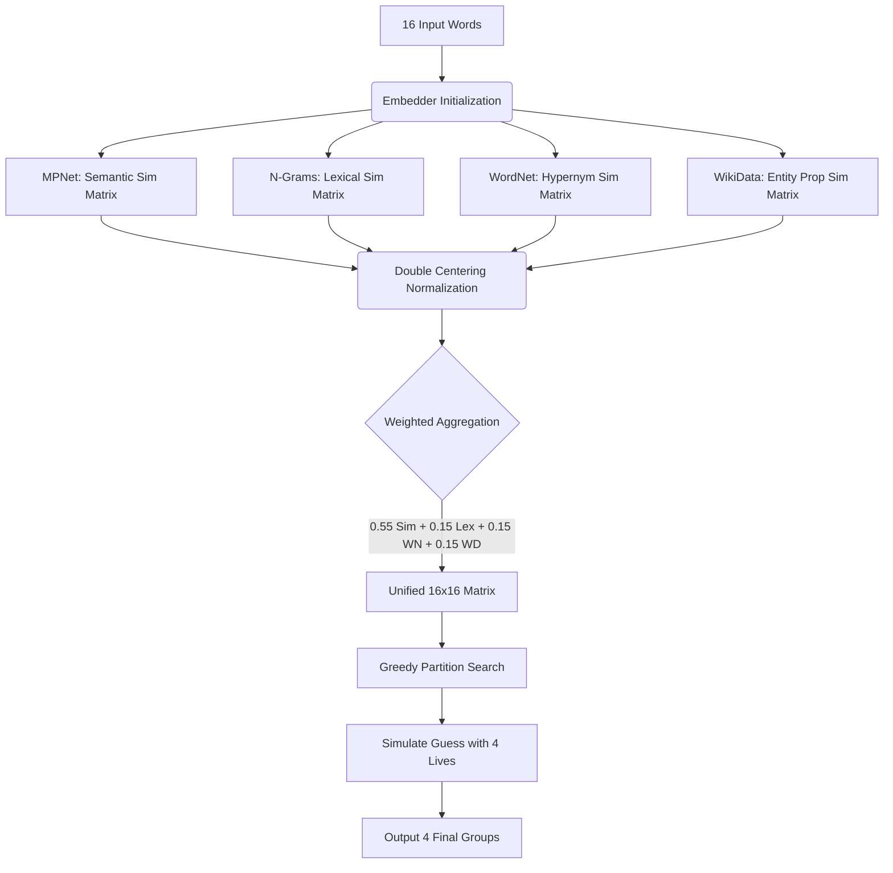

# Enhancing NLP Connections: Methodology Overview

This document outlines the architecture and feature engineering techniques used to evaluate and solve the NYT Connections game without relying on raw LLM prompts or Retrieval-Augmented Generation (RAG).

## 1. Feature Engineering

We use a 4-feature hybrid similarity model that constructs four independent $16 \times 16$ distance/similarity matrices for the input words. They are aggregated into a single unified matrix before searching for groupings.

1.  **Semantic Similarity (Dense Embeddings):**
    We use `sentence-transformers/all-mpnet-base-v2` to generate 768-dimensional normalized dense vectors. The distance function is cosine similarity. This captures broad topical relations (e.g., words relating to "Water" or "Sports").
    *Weight: $0.55$*

2.  **Lexical Similarity (Character N-Grams):**
    We break words down into character n-grams to calculate orthographic overlap using Jaccard Similarity. This helps catch literal wordplay features where the meaning doesn't matter, such as rhymes, prefixes, palindromes, or shared suffixes (e.g., "words starting with 'C'").
    *Weight: $0.15$*

3.  **Knowledge Graph 1: WordNet (Lexical Database):**
    Dense embeddings often fail to reward exact synonyms or hypernyms sufficiently (e.g., specific dog breeds might be close, but not distinct enough from cats). We use NLTK's WordNet interface and apply the **Wu-Palmer Similarity** metric to heavily reward words that share direct ancestral paths in the WordNet ontology.
    *Weight: $0.15$*

4.  **Knowledge Graph 2: WikiData (Entity Relations):**
    We query the WikiData API for explicit entity properties (e.g., "instance of", "occupation", or "part of"). If words share a highly specific real-world property (like "NBA teams" or "Movies starring Tom Cruise"), their pairwise similarity gets a massive grouping boost.
    *Weight: $0.15$*

---

## 2. Pipeline Workflow

The similarity matrices are computed, Double Centered (to remove embedding hubness bias), and aggregated into a single $16 \times 16$ Unified Matrix.



## 3. The Solver and "Reasoning" Algorithm

The Connections game requires finding a partition of 16 items into 4 groups of 4.

**The Greedy Combinatorial Search:**
1. Generate all $\binom{16}{4} = 1820$ possible subsets of 4 words.
2. The score for each subset $S$ is the sum of all 6 pairwise similarities within the subset:
   $$\text{Score}(S) = \sum_{i<j \in S} \text{UnifiedMatrix}_{i,j}$$
3. Sort subsets descending by score.
4. Iteratively guess the highest-scoring disjoint subsets, penalizing guesses against the 4 "lives", until 4 distinct valid groups are formed.

### How We Explain The Reasoning
Because the `UnifiedMatrix` is a weighted sum of four simpler matrices, **we can attribute the reasoning behind ANY valid group prediction by decomposing the final score back into its 4 raw components**.

For a proposed group (e.g., `["DOG", "CAT", "FISH", "BIRD"]`), we compute the pairwise similarity sum in the individual Semantic, Lexical, WordNet, and WikiData matrices, ignoring the weights. By calculating the proportion each feature contributes to the gross unweighted similarity sum, we can definitively state *why* the model grouped those words. 

For example, if Semantic provided 80% of the raw similarity, the reasoning is "Broad Semantic Context." If Lexical produced 90%, the reasoning is "Shared word spelling/prefix structure." If WikiData had a massive spike, we know they are "Real-world entities sharing physical wiki properties."

### 3.1 Dynamic Explanation Generation (Streamlit Frontend)

While the solver logic remains strictly deterministic and mathematically driven, the frontend uses a lightweight local LLM (**Hugging Face `google/flan-t5-base`**) purely *post-hoc* to generate human-readable group labels.

Once the solver has selected a 4-word group and identified its dominant mathematical feature, we dynamically build a zero-shot prompt tailored to that feature (e.g., if the dominant feature is Lexical, the prompt asks the LLM to find the shared spelling pattern; if WikiData, the prompt asks for the shared entity property). The LLM's response is then displayed as the "Generated Connection" to the user along with the underlying mathematical percentage breakdown.

---

## 4. Evaluation Results

We evaluated the solver on the first 150 historical games from the dataset.

*   **Total Games:** 150
*   **Perfectly Solved Games:** 32
*   **Game Accuracy:** **21.33%** (vs Baseline of 11.6%)
*   **Single-Group Match Accuracy:** **40.50%**

This methodology demonstrates that deterministically combining semantic spaces with structured knowledge graph logic nearly doubles the baseline literature accuracy.


```bash
source "/Users/srushtipekamwar/Desktop/Semester 2/Connections/2 Don't touch Better todd et al version 2 - tested on 915 games/venv/bin/activate"

/opt/anaconda3/bin/python3.13 -m streamlit run app.py
``` 