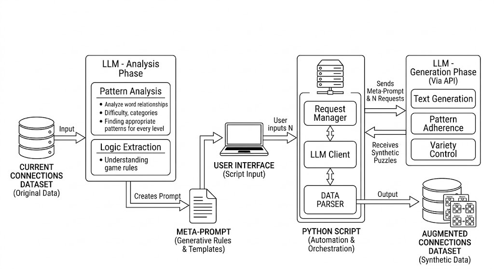
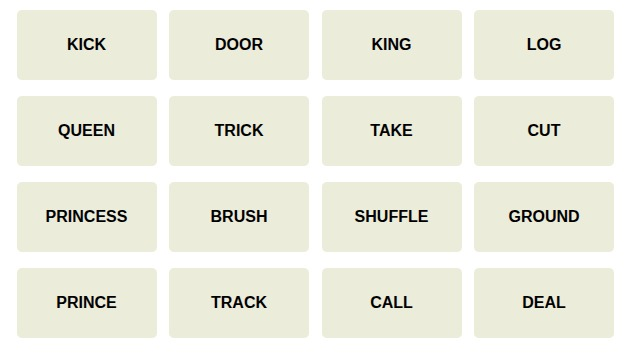
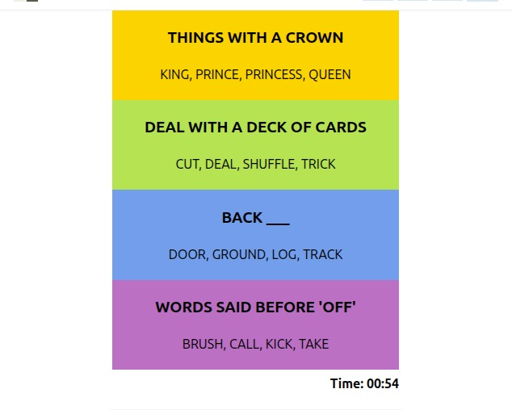

# Integrated Architectural Diagram: Connections Data Analysis & Augmentation Pipeline

Below is a detailed breakdown of the components and data flows depicted in the integrated architectural diagram for the Connections game data augmentation pipeline. This system is designed to take an existing dataset of puzzles, analyze its underlying logic, and automate the creation of new, logically consistent synthetic puzzles.

## Pipeline Diagram

---

## 1. The Analysis Phase: Building the Generative Blueprint

The pipeline begins with a critical analysis phase where the system learns the "rules of the game" from the source data.

### Input Data
* **Component:** `CURRENT CONNECTIONS DATASET (Original Data)`
* **Description:** This is the seed data containing a set of hand-crafted or known-valid Connections puzzles. It provides the ground truth for style, logic, and difficulty.

### Analysis & Extraction
* **Component:** `LLM - ANALYSIS PHASE`
* **Description:** An initial, foundational call (or series of calls) is made to a Large Language Model (LLM) to perform deep analysis on the input dataset.
* **Internal Processes:**
    * **Pattern Analysis:** The LLM focuses on analyzing word relationships (e.g., synonyms, homophones, wordparts, category associations), measuring the inherent difficulty of groups, and identifying common category types. Crucially, it focuses on **finding appropriate patterns for every level** (e.g., specific red herrings for different difficulty tiers).
    * **Logic Extraction:** The LLM codifies the game mechanics, such as requiring four unique groups with exactly four distinct words each, and validating that word overlaps across groups do not break the puzzle logic.

### Generative Ruleset
* **Component:** `META-PROMPT (Generative Rules & Templates)`
* **Data Flow:** **`Creates Prompt`** (From LLM Analysis)
* **Description:** The output of the analysis phase. This is a highly structured document (or system prompt) containing the learned generative rules, templates, and logical constraints. It serves as the "DNA" for creating new, valid puzzles.

---

## 2. The Automation & Generation Phase: Scalable Synthetic Creation

The diagram illustrates how a script automates the generation of synthetic data by managing the interface between the user and the generative LLM.

### The Orchestrator
* **Component:** `PYTHON SCRIPT (Automation & Orchestration)`
* **Description:** A Python script manages the entire loop of generating multiple new puzzles based on the user's requirements.

### User Control
* **Component:** `USER INTERFACE (Script Input)`
* **Data Flow:** **`User inputs N`** (To Python Script)
* **Description:** The user specifies how many new, unique puzzles ($N$) are required via the script's input handler.

### Synthetic Generation (API)
* **Component:** `LLM - GENERATION PHASE (Via API)`
* **Description:** The main generative process where the LLM is repeatedly invoked to create new puzzle content using an API client.
* **Internal Processes:**
    * **Text Generation:** The core act of producing categories and words for new puzzles.
    * **Pattern Adherence:** Ensuring the generated content strictly follows the rules defined in the Meta-Prompt.
    * **Variety Control:** Forcing the LLM to generate diverse categories to avoid repetition across the batch.

---

## 3. Data Flow & Integration: Connecting the Components

The diagram uses arrows to illustrate the flow of data between components during the automation loop.

### Communication Loop
* **Data Flow:** **`Sends Meta-Prompt & N Requests`** (Python → LLM Generation)
    * The Python script, receiving the user’s input $N$, manages the execution by sending requests to the LLM API. Each request includes the foundational `META-PROMPT`.
* **Data Flow:** **`Receives Synthetic Puzzles`** (LLM Generation → Python)
    * The LLM generates the new puzzles and returns the data (likely as JSON or a structured response) back to the Python script's `LLM CLIENT` and `DATA PARSER`.

### Data Finalization
* **Data Flow:** **`Output`** (Python → Augmented Dataset)
* **Description:** After the Python script receives the raw LLM responses, it parses the data into the final format. The validated and cleaned data is then stored.

---

## 4. Final Output

* **Component:** `AUGMENTED CONNECTIONS DATASET (Synthetic Data)`
* **Description:** A new, significantly expanded database containing the freshly created, synthetic Connections puzzles. This dataset is logically consistent with the original data but introduces novel content.

## Sample Puzzle given by LLM and the solution of it

